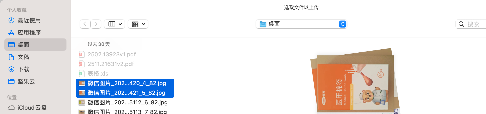
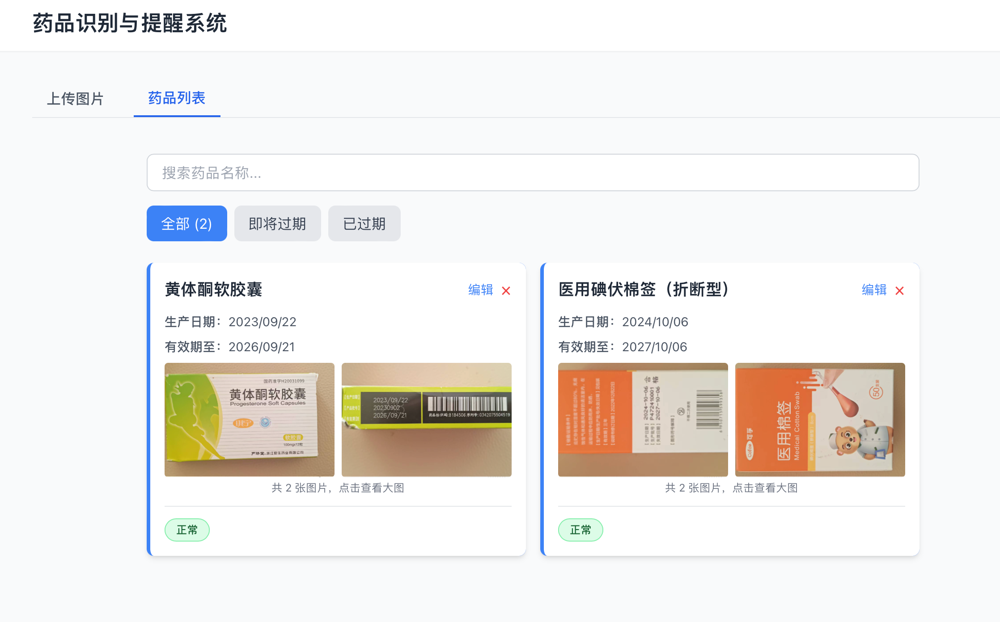

# 药品识别与提醒系统

<div align="center">


**本项目由阿里云 ESA 提供加速、计算和保护**

</div>

## 项目简介

一个基于 AI 视觉识别的智能药品管理系统，通过拍照或上传图片自动识别药品信息，并提供智能过期提醒功能。本项目结合了前沿的多模态 AI 技术、现代化的全栈开发架构和实用的健康管理场景，为家庭药品管理提供一站式解决方案。

### 🎯 实用性

- **解决真实痛点**：家庭药品管理混乱，过期药品难以识别，本系统通过 AI 自动识别药品信息，避免误食过期药品
- **操作简单便捷**：支持手机拍照和批量上传，无需手动输入，3 秒完成药品信息录入
- **智能提醒机制**：自动计算过期时间，提供分级提醒（正常/即将过期/已过期），帮助用户及时处理
- **多场景适用**：适用于家庭、药店、医疗机构等多种场景的药品管理需求

### 💡 创意性

- **多图融合识别**：创新性地支持多角度拍摄同一药品，通过多图融合分析提高识别准确率
- **智能信息提取**：利用大语言模型的视觉理解能力，从复杂的药品包装中精准提取关键信息
- **人性化交互设计**：支持手动编辑识别结果，结合 AI 智能识别和人工校验，确保信息准确性
- **实时搜索过滤**：提供快速搜索和智能筛选功能，方便用户快速定位目标药品

### 🔧 技术深度

- **多模态 AI 集成**：深度集成豆包 API 视觉模型，实现端到端的图像理解和信息提取
- **现代化全栈架构**：
  - 前端：React 18 + TypeScript + Vite，采用组件化设计和响应式布局
  - 后端：FastAPI 异步框架，支持高并发请求处理
  - 数据库：SQLite + SQLAlchemy ORM，支持灵活的数据库迁移
- **工程化实践**：
  - TypeScript 类型系统保证代码质量
  - RESTful API 设计，前后端分离架构
  - Docker 容器化部署，支持云原生部署
- **性能优化**：
  - 前端代码分割和懒加载
  - 后端异步文件处理和数据库操作
  - 图片压缩和缓存策略

## 功能特性

- 📸 **多方式上传**：支持手机拍照、本地上传、拖拽上传，支持批量多图上传
- 🤖 **AI 智能识别**：通过豆包 API 多模态模型自动识别药品名称、生产日期、有效期
- 🖼️ **多图融合分析**：支持同一药品多角度拍摄，通过多图推理提高识别准确率
- ⏰ **智能过期提醒**：自动计算过期时间，提供三级提醒（正常/即将过期/已过期）
- ✏️ **手动编辑功能**：支持手动修正 AI 识别结果，确保信息准确性
- 🔍 **快速搜索过滤**：支持药品名称搜索和状态筛选（全部/即将过期/已过期）
- 📱 **响应式设计**：完美适配移动端和桌面端，提供流畅的用户体验
- 💾 **数据持久化**：本地数据库存储，支持药品信息的增删改查

## 技术栈

### 前端技术
- **框架**：React 18（函数式组件 + Hooks）
- **语言**：TypeScript（类型安全）
- **构建工具**：Vite（快速构建和热更新）
- **样式**：Tailwind CSS（原子化 CSS，响应式设计）
- **HTTP 客户端**：Axios（API 请求）
- **状态管理**：React Context + Hooks（轻量级状态管理）

### 后端技术
- **框架**：FastAPI（高性能异步 Web 框架）
- **语言**：Python 3.9+
- **数据库**：SQLite + SQLAlchemy ORM（轻量级，支持迁移）
- **文件处理**：aiofiles（异步文件操作）
- **HTTP 客户端**：httpx（异步 HTTP 请求）

### AI 服务
- **视觉模型**：豆包 API（多模态大语言模型）
- **能力**：图像理解、信息提取、结构化输出

### 部署与运维
- **前端部署**：阿里云 ESA（弹性 Serverless 应用）- Pages 静态托管
- **后端部署**：阿里云函数计算 FC（Function Compute）- Serverless 函数（自定义运行时）
- **AI 服务**：火山引擎豆包 API（多模态视觉模型）
- **容器化**：Docker + Docker Compose（本地开发环境）
- **版本控制**：Git + GitHub

## 项目结构

```
drug_serve/
├── frontend/              # React 前端项目
│   ├── src/
│   │   ├── components/    # React 组件
│   │   ├── services/      # API 服务
│   │   ├── types/         # TypeScript 类型定义
│   │   └── utils/         # 工具函数（图片压缩等）
│   ├── package.json
│   └── vite.config.ts
├── backend/               # FastAPI 后端项目
│   ├── app/
│   │   ├── main.py        # FastAPI 应用入口
│   │   ├── database.py    # 数据库配置
│   │   ├── models.py      # 数据模型
│   │   ├── routers/       # API 路由
│   │   └── services/      # 业务逻辑（豆包 API 集成）
│   ├── bootstrap          # 函数计算启动脚本
│   ├── requirements.txt   # Python 依赖
│   └── Dockerfile.fc      # 函数计算 Dockerfile
├── edge-functions/        # 边缘函数（可选）
├── docs/                  # 文档目录
├── docker-compose.yml     # Docker Compose 配置
└── README.md              # 项目说明
```

详细文档：
- `FC_函数计算部署指南.md` - 后端函数计算部署指南
- `ESA_完整部署流程.md` - 前端 ESA 部署指南
- `完整环境变量配置清单.md` - 环境变量配置说明

## 安装与运行

### 后端设置

1. 进入后端目录：
```bash
cd backend
```

2. 创建虚拟环境：
```bash
python3 -m venv venv
source venv/bin/activate  # Windows: venv\Scripts\activate
```

3. 安装依赖：
```bash
pip install -r requirements.txt
```

4. 配置环境变量：
创建 `backend/.env` 文件（参考 `完整环境变量配置清单.md`）：
```env
API_BASE_URL=https://ark.cn-beijing.volces.com/api/v3
API_KEY=你的豆包API密钥
MODEL_ID=你的模型ID
DATABASE_URL=sqlite:///./drugs.db
UPLOAD_DIR=uploads
MAX_FILE_SIZE=10485760
```

5. 运行后端服务：
```bash
# 使用启动脚本（推荐）
./start.sh

# 或直接运行
uvicorn app.main:app --host 0.0.0.0 --port 8000 --reload
```

### 前端设置

1. 进入前端目录：
```bash
cd frontend
```

2. 安装依赖：
```bash
npm install
```

3. 运行开发服务器：
```bash
npm run dev
```

## 快速开始

### 使用启动脚本

**后端：**
```bash
cd backend
./start.sh
```

**前端：**
```bash
cd frontend
./start.sh
```

### 手动启动

参考上面的"安装与运行"部分。

## 配置说明

### 后端环境变量 (.env)

```env
# 豆包 API 配置
API_BASE_URL=https://ark.cn-beijing.volces.com/api/v3
API_KEY=your-api-key-here
MODEL_ID=your-model-id-here

# 数据库配置
DATABASE_URL=sqlite:///./drugs.db

# 上传文件配置
UPLOAD_DIR=uploads
MAX_FILE_SIZE=10485760  # 10MB
```

### 前端环境变量

开发环境会自动使用代理，生产环境需要配置 `VITE_API_BASE_URL`。

## 功能说明

1. **图片上传**：支持多张图片同时上传，支持拖拽上传和手机拍照
2. **智能识别**：自动识别药品名称、生产日期、有效期
3. **过期提醒**：
   - 🟢 正常：距离过期 > 30 天
   - 🟡 即将过期：距离过期 ≤ 30 天
   - 🔴 已过期：已超过有效期
4. **药品管理**：查看、筛选、删除药品记录

## 使用步骤

### 步骤 1：上传药品图片

点击"上传图片"标签，支持以下方式上传：
- 📸 手机拍照
- 📁 相册选择
- 💻 本地上传
- 🖱️ 拖拽上传

支持同时上传多张图片，系统会自动压缩以确保上传成功。



### 步骤 2：查看药品列表

上传并识别完成后，切换到"药品列表"标签，可以：
- 📋 查看所有已识别的药品信息
- 🔍 搜索药品名称
- 🎯 筛选过期状态（全部/即将过期/已过期）
- ✏️ 编辑药品信息
- 🗑️ 删除药品记录



## 部署

### 生产环境部署架构

```
前端（ESA Pages） → 后端（函数计算 FC） → 豆包 API
```

- **前端**：部署到阿里云 ESA，通过环境变量 `VITE_API_BASE_URL` 连接后端
- **后端**：部署到阿里云函数计算 FC（自定义运行时），监听端口 9000
- **AI 服务**：使用火山引擎豆包 API 进行图片识别

### 快速部署指南

#### 1. 后端部署（函数计算 FC）

1. **准备代码包**
   ```bash
   cd backend
   ./package_fc.sh  # 或手动打包，排除 venv、uploads 等目录
   ```

2. **在函数计算控制台创建函数**
   - 选择自定义运行时（Custom Runtime）
   - 上传代码包或 Docker 镜像
   - 启动命令：`./bootstrap`
   - 监听端口：`9000`

3. **配置环境变量**（在函数计算控制台）
   ```env
   API_BASE_URL=https://ark.cn-beijing.volces.com/api/v3
   API_KEY=你的豆包API密钥
   MODEL_ID=你的模型ID（如 doubao-1.5-vision-pro-250328）
   DATABASE_URL=sqlite:///./drugs.db
   UPLOAD_DIR=/tmp/uploads
   MAX_FILE_SIZE=10485760
   ```

4. **创建 HTTP 触发器**
   - 触发器类型：HTTP 触发器
   - 认证方式：匿名访问
   - 获取触发器访问地址（用于前端配置）

#### 2. 前端部署（ESA）

1. **在 ESA 控制台创建应用**
   - 代码源：GitHub 仓库
   - 构建目录：留空（使用根目录）
   - 安装命令：`npm install`
   - 构建命令：`npm run build`
   - 输出目录：`frontend/dist`

2. **配置环境变量**（在 ESA 控制台）
   ```env
   VITE_API_BASE_URL=https://your-function-url.cn-hangzhou.fcapp.run
   ```
   **注意**：使用 `https://` 协议，不要加末尾斜杠

3. **构建和部署**
   - 保存环境变量后触发构建
   - 等待构建完成并部署

详细部署步骤请参考：
- `FC_函数计算部署指南.md` - 后端部署详细指南
- `ESA_完整部署流程.md` - 前端部署详细指南
- `完整环境变量配置清单.md` - 环境变量配置说明

## API 文档

后端服务运行后，访问 `http://localhost:8000/docs` 查看 Swagger API 文档。

## 注意事项

1. **豆包 API 配置**：需要在 `.env` 文件中配置正确的 `API_KEY` 和 `MODEL_ID`
2. **模型 ID**：请根据实际使用的豆包模型 ID 进行配置
3. **图片大小**：默认最大支持 10MB，可在 `.env` 中修改 `MAX_FILE_SIZE`
4. **生产环境**：建议修改 CORS 配置，限制允许的域名

## 技术亮点

### 1. 多图融合识别技术
- 支持同一药品多角度拍摄，将多张图片作为上下文一起发送给 AI 模型
- 通过多图推理提高识别准确率，特别适用于复杂包装或信息分散的情况

### 2. 智能信息提取
- 利用大语言模型的视觉理解能力，从复杂的药品包装中提取结构化信息
- 支持 JSON 格式输出，便于后续处理和存储

### 3. 数据库动态迁移
- 实现了数据库 Schema 的动态迁移机制，支持在不丢失数据的情况下添加新字段
- 解决了生产环境数据库升级的痛点

### 4. 前后端分离架构
- 清晰的 API 设计，支持跨域请求
- 前端独立部署，后端可单独扩展

## 项目展示

### 核心功能演示

1. **图片上传**：支持拖拽、点击、拍照多种方式
2. **AI 识别**：自动提取药品信息，识别准确率高
3. **智能提醒**：颜色标识过期状态，一目了然
4. **数据管理**：支持搜索、筛选、编辑、删除

## 开发历程

本项目从零开始构建，经历了以下关键阶段：

1. **需求分析**：明确药品管理的核心痛点
2. **技术选型**：选择合适的前后端技术栈
3. **API 集成**：深度集成豆包 API，优化提示词工程
4. **功能迭代**：从单图识别到多图融合，从基础功能到智能提醒
5. **部署优化**：解决 ESA 构建和部署中的各种问题

## 未来规划

- [ ] 支持药品分类和标签管理
- [ ] 添加药品库存管理功能
- [ ] 支持多用户和家庭共享
- [ ] 集成药品说明书查询
- [ ] 支持药品二维码扫描识别
- [ ] 添加数据导出和备份功能

## 贡献

欢迎提交 Issue 和 Pull Request！

## 许可证

MIT

---

<div align="center">

**本项目由阿里云 ESA 提供加速、计算和保护**

Powered by [阿里云 ESA](https://www.aliyun.com/product/esa)

</div>

